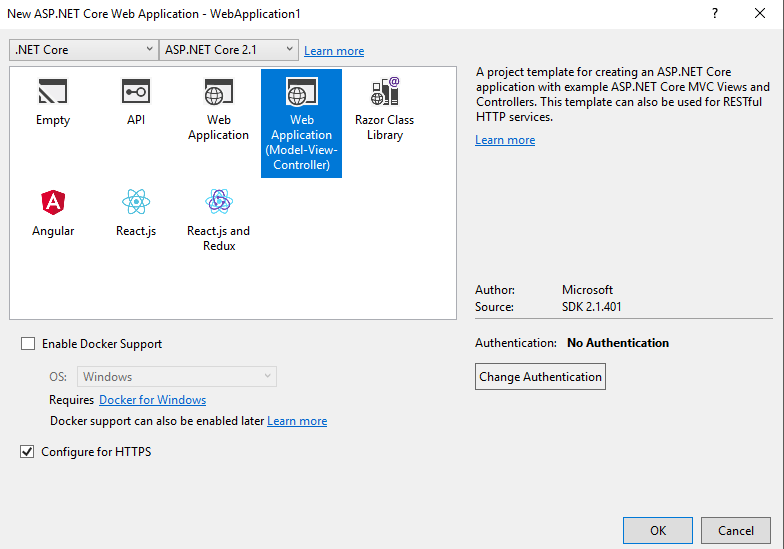
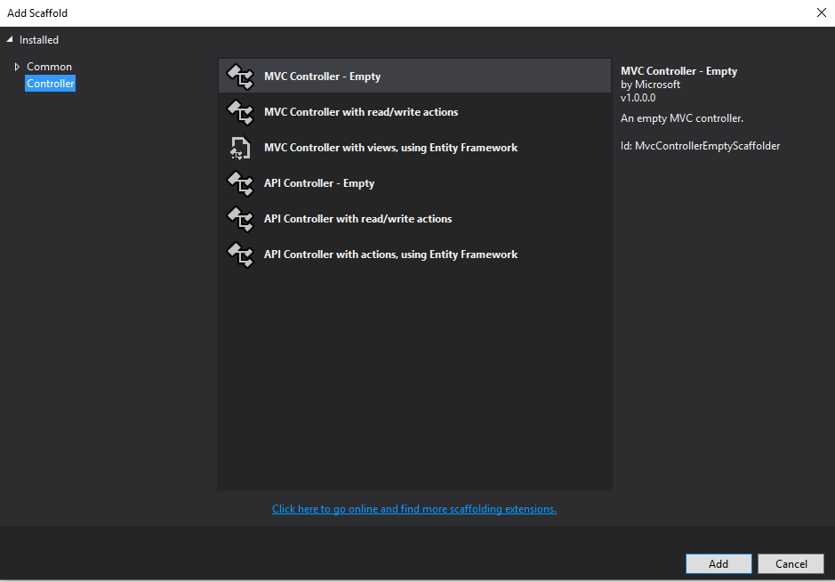
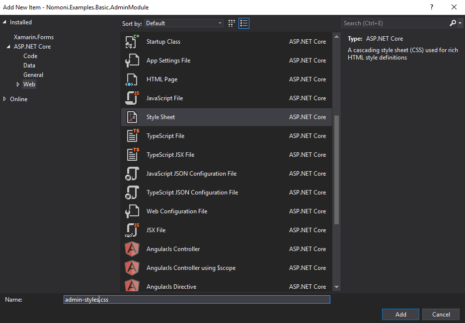
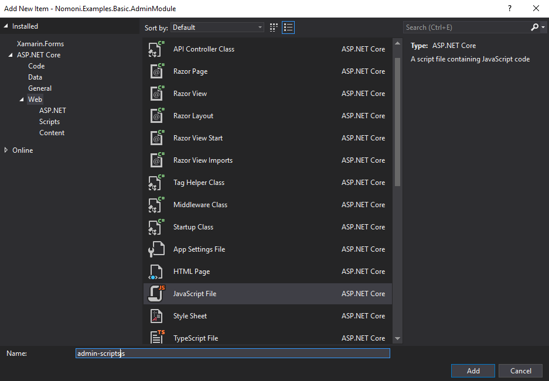
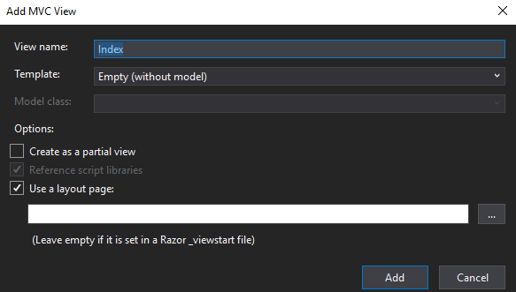

## Prerequisites

To start this tutorial you will need to have completed In [Part 1 : Basic Web App with single module](https://treefish.uk/nomoni/docs/tutorials/part-one-basic-web-app-with-single-module). The result of which is a basic MVC .net core app with a single module that looks and plays just like the standard .net core template app.

The source code for part one is available [HERE](https://github.com/treefishuk/nomoni/tree/master/examples/Nomoni.Examples.Basic)


## Outcome

We are going to add a second module to the solution. The second module will be a a simple "Admin" module. With custom Controller, Model, View, CSS and Javascript. All located in a self contained project. 

## Step 1 : Add a new project using MVC template

This will form the basic of our new module.




## Step 2 : Install Nomoni.Mvc nuget package

Install the Nomoni.Mvc package in the new admin module project

```
Install-Package Nomoni.Mvc
```

## Step 3 : Remove Unnecessary Things

Like before delete : 

- Startup.cs
- appsettings.json

This time also delete:

- Everything in Models
- Everything in Views
- Everything in Controllers
- Everything in wwwroot

We will create a custom controller, models, view and static content later on.

As before amend Project.cs to the following:

```
    public class Program
    {
        public static void Main(string[] args)
        {
        }
    }
```

## Step 4 : Update Project .csproj

Update the modules .csproj file to look like this:

```
<Project Sdk="Microsoft.NET.Sdk.Web">

  <PropertyGroup>
    <TargetFramework>netcoreapp2.1</TargetFramework>
    <GenerateEmbeddedFilesManifest>true</GenerateEmbeddedFilesManifest>
  </PropertyGroup>
  
  <ItemGroup>
    <EmbeddedResource Include="Views\**;wwwroot\**" />
  </ItemGroup>

  <ItemGroup>
    <PackageReference Include="Microsoft.AspNetCore.App" />
    <PackageReference Include="Nomoni.Mvc" Version="0.1.18246" />
  </ItemGroup>

</Project>
```


## Step 5 : Create Module Definition

Add a new folder to the module project called "Registrations".

Add a new file called "ModuleInfo.cs" and implement the IModule interface found in Nomoni.Core.Abstractions

This time the module we are creating will be for an "admin" area of the website. It will work like an MVC area but will have the benefit of a separate assembly.

```
    public class ModuleInfo : IModule
    {
        public string Name => "Admin Module";

        public string Author => "Jon Ryan";
    }
```


## Step 6 : Create a New Controller

Create a new empty controller



And name it "ManagementController"


Which should produce : 

```
    public class ManagementController : Controller
    {
        public IActionResult Index()
        {
            return View();
        }
    }

```


## Step 7 : Create a New Model

In the models folder create a new view model called "ManagmentViewModel"

```
    public class ManagmentViewModel
    {

        public string PageTitle { get; set; }

        public string PageContent { get; set; }

    }
```

## Step 8 : Create a New stylesheet

In wwwroot -> css add a new stylesheet called "admin-styles"




Update it's contents to the following:

```
.admin-heading{
    font-size: 20px;
    color: #0094ff
}

```


## Step 9 : Create a New Javascript File

In wwwroot -> js add a new javascript file called "admin-scripts"




Update it's contents to the following:

```

document.getElementById("button").addEventListener("click", function (e) {
    alert("You clicked a button!");
});

```
## Step 10 : Create a New View

In Views -> Management add a new view called Index



Update it's contents to the following:

```


@model Nomoni.Examples.Basic.AdminModule.Models.ManagmentViewModel

@{
    ViewData["Title"] = Model.PageTitle;
}

<link rel="stylesheet" href="~/css/admin-styles.css" />

<h2 class="admin-heading">@Model.PageTitle</h2>

<a href="#" id="button" class="btn btn-primary">Click Me</a>

<script src="~/js/admin-scripts.js"></script>

```

Obviously the stylesheet and script location is not ideal. So The next tutorial will cover making that better

## Step 11 : Update the Controller

Update the contents of the ManagementController.cs to the following:

```
using Microsoft.AspNetCore.Mvc;
using Nomoni.Examples.Basic.AdminModule.Models;

namespace Nomoni.Examples.Basic.AdminModule.Controllers
{
    public class ManagementController : Controller
    {
        public IActionResult Index()
        {

            var model = new ManagmentViewModel()
            {
                PageContent = "I'm some page content",
                PageTitle = "Management Page"
            };

            return View(model);
        }
    }
}
```


## Step 12 : Create Route Registration Definition

Add a new file to "Registrations" called "RouteRegistration.cs" and implement the IRouteRegistration interface found in Nomoni.Mvc.Registration

```
using Microsoft.AspNetCore.Builder;
using Microsoft.AspNetCore.Routing;
using Nomoni.Mvc.Registration;

namespace Nomoni.Examples.Basic.AdminModule.Registrations
{
    public class RouteRegistration : IRouteRegistration
    {
        public int Priority => 2000;

        public void Execute(IRouteBuilder routeBuilder)
        {
            routeBuilder.MapRoute(name: "admin", template: "admin/{controller}/{action}/{id?}", defaults: new { controller = "Home", action = "Index" });
        }
    }
}

```

## Step 13 : Add Created Module

Add a reference to the new admin module from the main project. 

## Step 14 : Launch App

Add the module created as a reference in the master project, build and run.

If the steps were successful then you should have a classic ASP .net Core App running


This time you should be able to access content from the new admin module by going to "/admin/management" which should look like this :


Clicking on the button should produce the alert message, and the title has been styled with the admin stylesheet.


## The Source Code for this Tutorial can be found

[https://github.com/treefishuk/nomoni/tree/master/examples/Nomoni.Examples.SecondModule](https://github.com/treefishuk/nomoni/tree/master/examples/Nomoni.Examples.SecondModule)

## Next Steps

In the Next Tutorial we will fix the issues with the css and javascript placement, and also amend the navigation bar to include the new admin module.

[Part 3 : Asset and Navigation Improvements](/nomoni/docs/tutorials/part-three-asset-and-nav-improvements)
