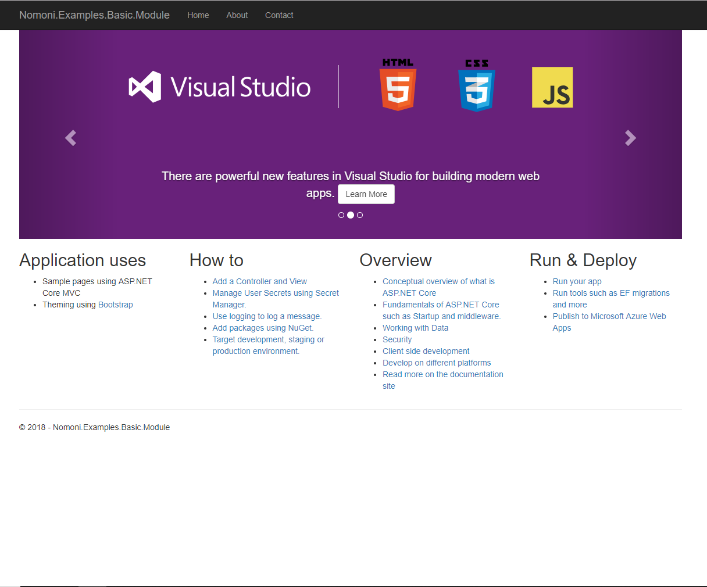

# Getting Started - Part 2 : Adding Another Module


## Prerequisites

To start this tutorial you will need to have compeleted In [Part 1 : Basic Web App with single module](/nomoni/docs/tutorials/part-one-basic-web-app-with-single-module ).

## Outcome


## Step 1 : Add a new project using MVC template

This wil form the basic of our new module.


## Step 2 : Install Nomoni.Mvc nuget package

Install the Nomoni.Mvc package in the empty project

```
Install-Package Nomoni.Mvc
```

## Step 3 : Remove Unnecessary Things

Like before delete : 

- Startup.cs
- appsettings.json

This time also delete:

- Everything in Models
- Everything in Views
- Everything in Controllers
- Everything in wwwroot

We will create a custom controller, models, view and static content later on.

As before ammend Project.cs to the following:

```
    public class Program
    {
        public static void Main(string[] args)
        {
        }
    }
```

## Step 4 : Update Project .csproj

Update the modules .csproj file to look like this:

```
<Project Sdk="Microsoft.NET.Sdk.Web">

  <PropertyGroup>
    <TargetFramework>netcoreapp2.1</TargetFramework>
    <GenerateEmbeddedFilesManifest>true</GenerateEmbeddedFilesManifest>
  </PropertyGroup>
  
  <ItemGroup>
    <EmbeddedResource Include="Views\**;wwwroot\**" />
  </ItemGroup>

  <ItemGroup>
    <PackageReference Include="Microsoft.AspNetCore.App" />
    <PackageReference Include="Nomoni.Mvc" Version="0.1.18246" />
  </ItemGroup>

</Project>
```


## Step 5 : Create Module Definition

Add a new folder to the module project called "Actions".

Add a new file called "ModuleInfo.cs" and implement the IModule interface found in Nomoni.Core.Abstractions

This time the module we are creating will be for an "admin" area of the website. It will work like an MVC area but will have the benifit of a seperate assembly.

```
    public class ModuleInfo : IModule
    {
        public string Name => "Admin Module";

        public string Author => "Jon Ryan";
    }
```


## Step 6 : Create a New Admin Controller

coming soon...

## Step 7 : Create a New Model

coming soon...

## Step 8 : Create a New stylesheet

coming soon...

## Step 9 : Create a New Javascript File

coming soon...

## Step 10 : Create a New View

coming soon...

## Step 11 : Create Route Registration Definition

Add a new file to "Actions" called "RouteRegistration.cs" and implement the IRouteRegistration interface found in Nomoni.Mvc.Registration

```
    public class RouteRegistration : IRouteRegistration
    {
        public int Priority => 1000;

        public void Execute(IRouteBuilder routeBuilder)
        {
            routeBuilder.MapRoute(name: "module", template: "admin/{controller}/{action}/{id?}", defaults: new { controller = "Home", action = "Index" });
        }
    }
```

## Step 8 : Launch App

Add the module created as a reference in the master project, build and run.

If the steps were successful then you should have a classic ASP .net Core App running



## The Source Code for this Tutorial can be found


## Next Steps

coming soon...